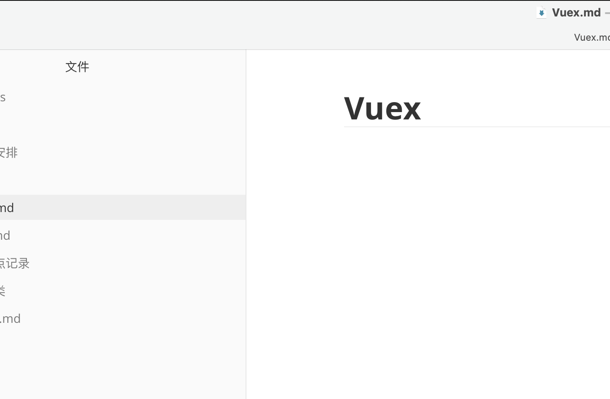

# Vuex





```javascript
<template>
  <a-form-model
    ref="form"
    :model="auditInfo"
    :label-col="labelCol"
    :wrapper-col="wrapperCol"
    :rules="rules"
    class="form-layout"
  >
    <a-form-model-item v-if="flowShowAction" label="处理操作" prop="currentAction.key" class="form-layout__item-col1">
      <a-radio-group
        v-model="auditInfo.currentAction.key"
        name="radioGroup"
        @change="changeCurrentAction"
      >
        <a-radio
          v-for="(item, index) in acceptActions"
          :key="index"
          :disabled="item.disabled"
          name="acceptActions"
          :value="item.key"
        >
          {{ item.value }}
        </a-radio>
      </a-radio-group>
    </a-form-model-item>

    <a-form-model-item v-if="nodeType === 'Delegate'" label="流程回到我" class="form-layout__item-col1">
      <a-checkbox v-model="auditInfo.flowBackToMe" />
    </a-form-model-item>
    <template v-if="flowShowComment">
      <a-form-model-item v-if="auditInfo.currentAction.key === 'Reject'" key="opinionRequired" prop="opinion" label="处理意见" class="form-layout__item-col1">
        <a-textarea
          v-model="auditInfo.opinion"
          placeholder="请填写处理意见"
          :auto-size="{ minRows: 3, maxRows: 5 }"
        />
      </a-form-model-item>
      <a-form-model-item v-else key="opinion" label="处理意见" class="form-layout__item-col1">
        <a-textarea
          v-model="auditInfo.opinion"
          placeholder="请填写处理意见"
          :auto-size="{ minRows: 3, maxRows: 5 }"
        />
      </a-form-model-item>
    </template>
    <a-form-model-item v-if="!isResolve && auditInfo.currentAction.key !== 'Reject'" key="nextAuditInfoProp" label="下一处理节点" :prop="nextAuditInfoProp" class="next-audit-info form-layout__item-col1">
      <a-select v-model="nodeType">
        <a-select-option
          v-for="(item, index) in nextNodeType"
          :key="index"
          :value="item.key"
        >
          {{ item.value }}
        </a-select-option>
      </a-select>
      <select-next-audit
        :node-type="nodeType"
        :data-source="dataSource"
        :watch-value="selectNextAuditWatch"
        class="select-next-audit"
        @selectAuditorOk="selectAuditorOk"
      />
    </a-form-model-item>
  </a-form-model>
</template>
```

