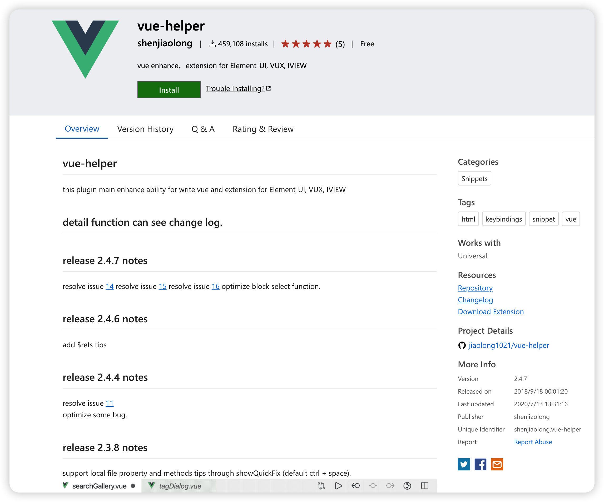

# vscode插件

## [别名路径跳转](https://marketplace.visualstudio.com/items?itemName=lihuiwang.vue-alias-skip)

> 支持引入跳转到相应的文件

## [vue-helper](https://marketplace.visualstudio.com/items?itemName=shenjiaolong.vue-helper)

> 支持方法跳转

